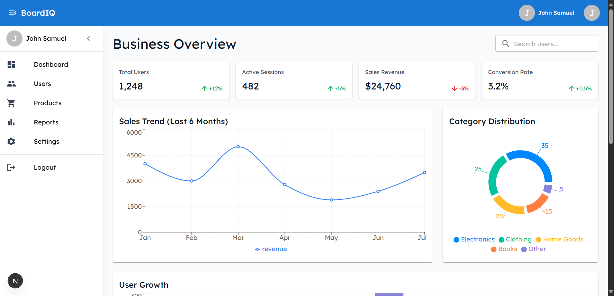

# Business Intelligence Dashboard - README



## Overview

A modern Business Intelligence (BI) tool with user authentication, data visualization, and interactive dashboard features. Built with Next.js, Tailwind CSS, and Material-UI (MUI) components.

## Features

### Core Features
- User authentication (login/registration)
- Interactive data visualizations (charts & metrics)
- Fully responsive dashboard
- Auto-logout functionality
- Protected routes

### Authentication
- Login with email/password
- Registration flow
- "Keep me logged in" option
- Auto-logout after 1 minute of inactivity (when not "kept logged in")

### Dashboard
- **Metrics Cards**: Key business metrics at a glance
- **Charts**:
  - Line chart for sales trends
  - Bar chart for user growth
  - Pie chart for category distribution
- **Data Table**: Sortable and filterable user/sales data

## Technologies Used

### Frontend
- **Framework**: Next.js
- **Styling**: Tailwind CSS
- **UI Components**: Material-UI (MUI)
- **Charts**: Recharts
- **State Management**: React Context API

### Backend (Mock)
- Mock Service Worker (MSW) for API mocking

## Getting Started

### Prerequisites
- Node.js v18+
- npm or yarn
- Git

### Installation

1. Clone the repository:
   ```bash
   git clone https://github.com/codegallantx/boardiq.git
   cd boardiq
   ```

2. Install dependencies:
   ```bash
   npm install
   # or
   yarn install
   ```

3. Set up environment variables:
   ```bash
   cp .env.example .env.local
   ```
   (No actual secrets needed for the mock API)

4. Run the development server:
   ```bash
   npm run dev
   # or
   yarn dev
   ```

5. Open [http://localhost:3000](http://localhost:3000) in your browser.

## Project Structure
```
boardiq
    ├── .gitignore
    ├── README.md
    ├── jsconfig.json
    ├── next.config.mjs
    ├── package-lock.json
    ├── package.json
    ├── postcss.config.mjs
    ├── public
        ├── file.svg
        ├── globe.svg
        ├── next.svg
        ├── vercel.svg
        └── window.svg
    └── src
        ├── app
            ├── auth
            │   ├── login
            │   │   └── page.js
            │   └── register
            │   │   └── page.js
            ├── dashboard
            │   └── page.js
            ├── favicon.ico
            ├── globals.css
            ├── layout.js
            ├── middleware.js
            └── page.js
        ├── components
            ├── DarkModeToggle.js
            ├── auth
            │   ├── AuthForm.js
            │   └── AuthLayout.js
            └── dashboard
            │   └── Sidebar.js
        ├── context
            ├── AuthContext.js
            ├── DarkModeContext.js
            └── ThemeContext.js
        ├── hooks
            ├── useAuth.js
            └── useDarkMode.js
        ├── mocks
            ├── handlers.js
            └── server.js
        └── utils
            └── api.js
```

## Mock Credentials

For testing purposes, use these credentials:

**User:**
- Email: `user@example.com`
- Password: `User@123`

Or register a new account.

## Deployment

The application is configured for easy deployment on Vercel:

1. Push your code to a GitHub repository
2. Create a new project in Vercel
3. Connect your GitHub repository
4. Deploy!

[](https://vercel.com/new)

## Design Considerations

### UI/UX
- Mobile-first responsive design
- Consistent color scheme and typography
- Accessible components (ARIA labels, keyboard navigation)
- Smooth transitions between states

### Security
- Protected routes
- Mock JWT authentication
- Password hashing simulation
- Auto-logout for inactive sessions

### Performance
- Code splitting with Next.js
- Optimized chart rendering
- Efficient state management
- Lazy loading for non-critical components

## License

This project is licensed under the MIT License - see the [LICENSE](LICENSE) file for details.

## Contact

For questions or feedback, please contact:
GitHub: [@codegallantx](https://github.com/codegallantx)